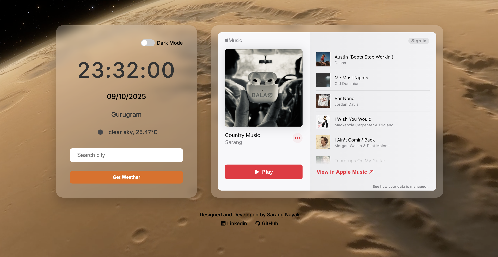
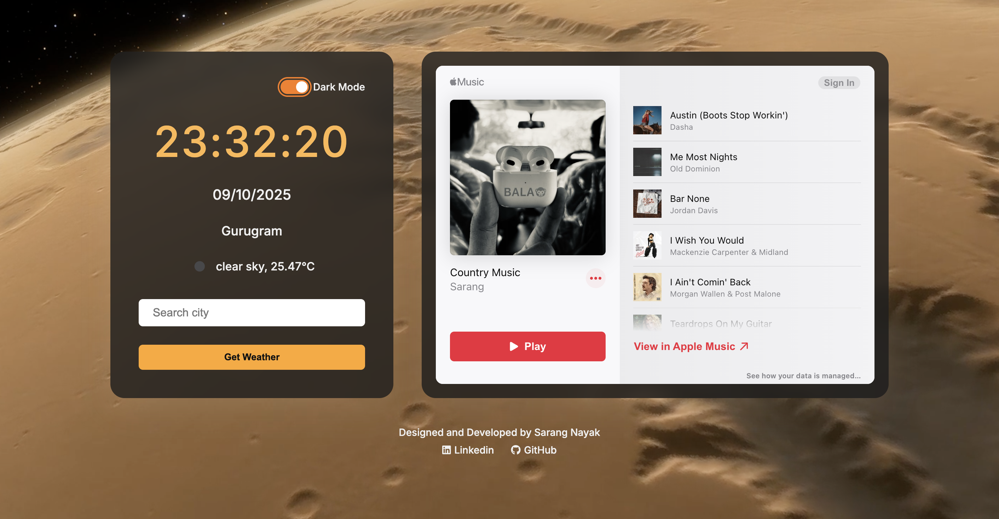

# ⏰ Digital Clock

[](LICENSE)  
  
  
  


---

## 🌐 Live Demo  
*(https://github.com/sarangnayak/Digital-Clock)*  

---

## 🖼️ Preview

  

 
*(Place a screenshot of your clock UI in `assets/preview.png` so it shows here)*

---

## 🧠 About

**Digital Clock** is a minimal, responsive web clock built using vanilla **HTML**, **CSS**, and **JavaScript**.  
It shows the current time (hours, minutes, seconds) and optionally displays the date or AM/PM.

---

## 🔧 Features

- Real-time time display (hh:mm:ss)  
- 12-hour / 24-hour format (if implemented)  
- Date display (if included)  
- Responsive layout — works on desktops and mobile  
- Lightweight and dependency-free  

---

## 📂 Folder Structure

```text
Digital-Clock/
│
├── index.html        # Main clock markup  
├── style.css         # Styling & layout  
├── script.js         # Time update logic  
└── assets/            # Images, icons, previews
```
🚀 Usage / Setup
1.	Clone the repository
  ```
git clone https://github.com/sarangnayak/Digital-Clock.git
cd Digital-Clock
```
2.	Open index.html in your browser
3.	(Optional) Modify styles or add features
4.	Deploy via GitHub Pages or your preferred host
---
🧩 Customization Ideas
	•	Add AM / PM toggle or switch between 12h/24h
	•	Show date & day of week
	•	Add themes (dark / light)
	•	Add animations for transitions (CSS or JS)
	•	Add alarm / timer functionality

⸻

🤝 Contributing

Contributions are welcome!
	•	Fork the repo
	•	Make your changes in a feature branch
	•	Open a Pull Request

⸻

📜 License

This project is licensed under the MIT License.
See the LICENSE file for details.

⸻

👤 Author

Sarang Nayak
🔗 GitHub
🌐 Portfolio

⸻

//⭐ Star this repo if you find it useful!//
